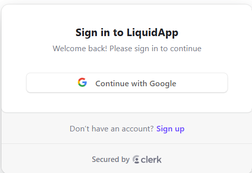
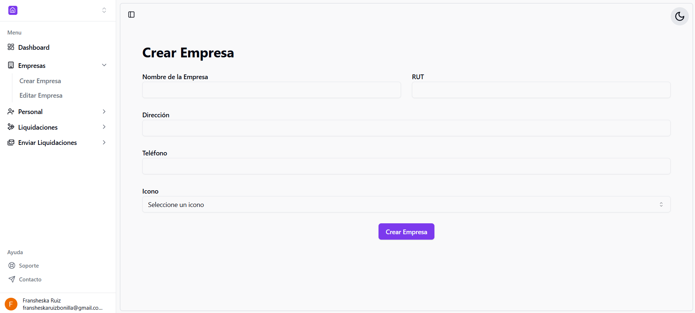
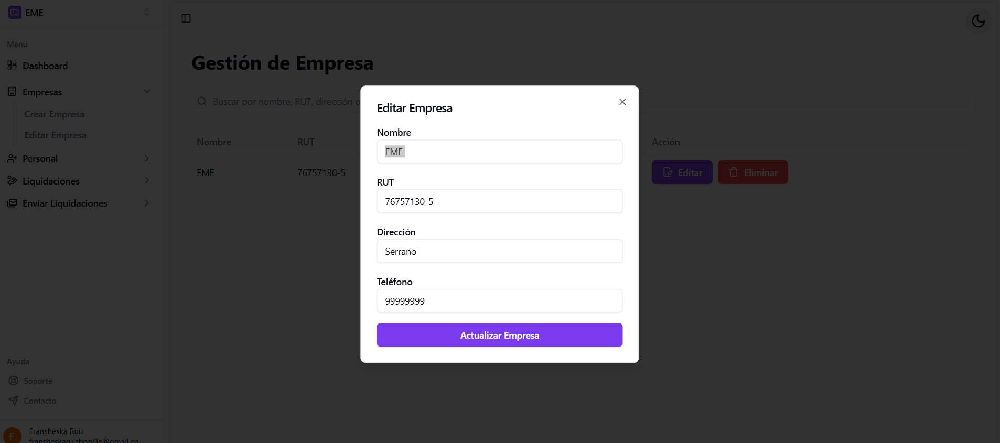
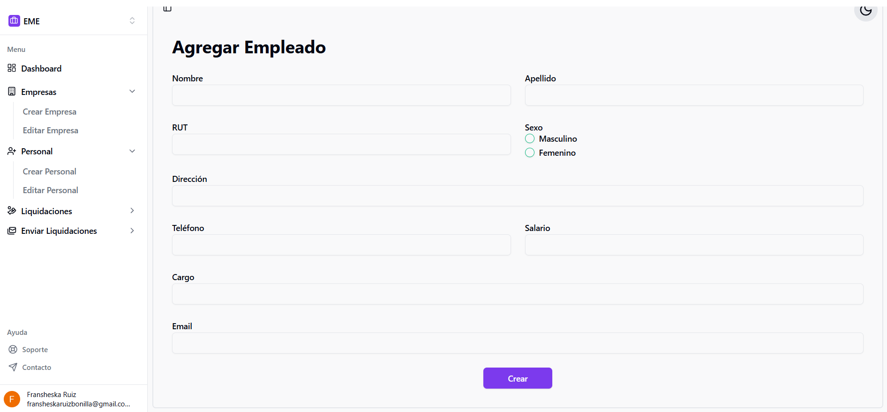
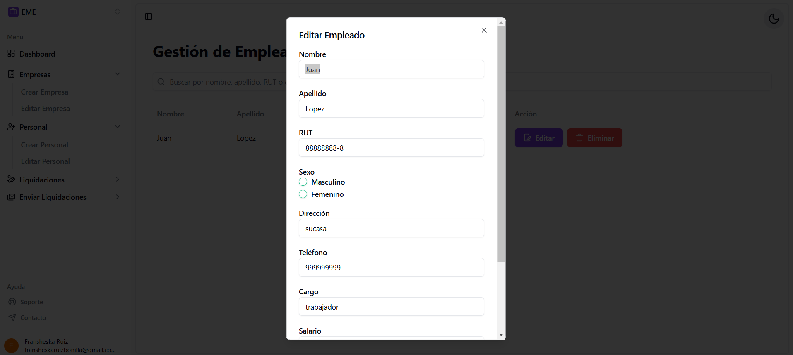
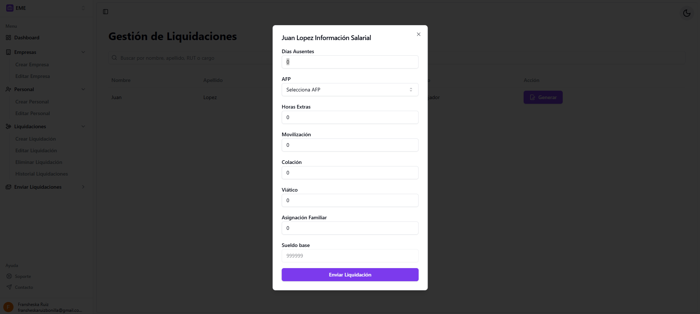
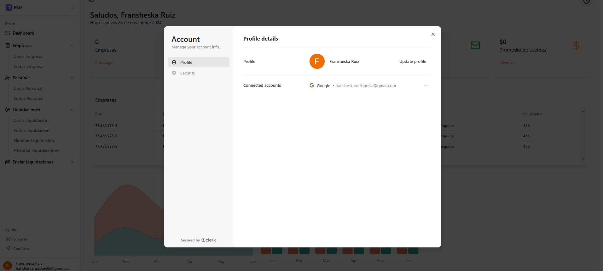

# Manual de Usuario

## Índice
1. [Introducción](#introducción)
2. [Inicio de Sesión y Registro](#inicio-de-sesión-y-registro)
3. [Vista de Panel Principal](#vista-de-panel-principal)
4. [Gestión de Empresas](#gestión-de-empresas)
   - [Agregar Empresa](#agregar-empresa)
   - [Editar Empresa](#editar-empresa)
   - [Eliminar Empresa](#eliminar-empresa)
5. [Gestión de Trabajadores](#gestión-de-trabajadores)
   - [Agregar Trabajador](#agregar-trabajador)
   - [Editar Trabajador](#editar-trabajador)
   - [Eliminar Trabajador](#eliminar-trabajador)
6. [Generación de Liquidaciones de Sueldo](#generación-de-liquidaciones-de-sueldo)
7. [Configuración de Usuario](#configuración-de-usuario)
8. [Preguntas Frecuentes](#preguntas-frecuentes)
9. [Soporte Técnico](#soporte-técnico)

---

## Introducción

Bienvenido/a al manual de usuario de la aplicación **LiquidApp**. Esta guía detalla los pasos para utilizar cada una de las funcionalidades de la aplicación, incluyendo gestión de empresas, trabajadores, y generación de liquidaciones de sueldo. Si tienes alguna duda adicional, consulta la sección de [Soporte Técnico](#soporte-técnico).

---

## Inicio de Sesión y Registro

1. **Acceso a la App**: 
   - Visita la URL de la aplicación.
   - En la pantalla de inicio, elige entre **Iniciar Sesión** o **Registrarse** según corresponda.
   
2. **Registro de Usuario Nuevo**:
   - Completa el formulario de registro con tus datos personales (nombre, correo electrónico, contraseña, etc.).
   - Haz clic en **Registrar**.
   
3. **Iniciar Sesión**:
   - Ingresa tu correo electrónico y contraseña.
   - Pulsa en **Iniciar Sesión**.
   

---

## Vista de Panel Principal

Al iniciar sesión, serás dirigido al panel principal, donde encontrarás:
- Acceso rápido a la gestión de empresas y trabajadores.
- Opciones para generar liquidaciones de sueldo y ver informes.
- Configuración de usuario.

---

## Gestión de Empresas

### Agregar Empresa

1. Navega a **Empresas** en el menú principal.
2. Haz clic en **Agregar Empresa**.
3. Completa el formulario con los datos de la empresa (nombre, dirección, teléfono, etc.).
4. Haz clic en **Guardar** para registrar la empresa.

### Editar Empresa

1. En la lista de empresas, selecciona la empresa que deseas editar.
2. Haz clic en **Editar** y actualiza la información.
3. Pulsa **Guardar** para aplicar los cambios.

### Eliminar Empresa

1. En la lista de empresas, busca la empresa que deseas eliminar.
2. Haz clic en el botón **Eliminar** y confirma la acción.

---

## Gestión de Trabajadores

### Agregar Trabajador

1. Dirígete a **Trabajadores** en el menú principal.
2. Pulsa en **Agregar Trabajador**.
3. Completa el formulario con los datos del trabajador (nombre, apellido, RUT, etc.).
4. Haz clic en **Guardar** para registrar al trabajador.

### Editar Trabajador

1. Selecciona el trabajador que deseas editar en la lista.
2. Haz clic en **Editar** y modifica la información.
3. Haz clic en **Guardar** para confirmar los cambios.

### Eliminar Trabajador

1. En la lista de trabajadores, selecciona al trabajador que deseas eliminar.
2. Pulsa **Eliminar** y confirma la acción.

---

## Generación de Liquidaciones de Sueldo

1. En la **sección de Trabajadores**, selecciona el trabajador para el cual deseas emitir una liquidación.
2. Haz clic en **Generar Liquidación**.
3. Completa los datos adicionales necesarios (descuentos, horas extras, etc.).
4. Haz clic en **Emitir Liquidación** para crear el documento PDF.

---

## Configuración de Usuario

1. Accede a **Configuración** en el menú principal.
2. Aquí podrás cambiar tus datos de perfil, como correo electrónico, contraseña, y preferencias de notificaciones.
3. Haz clic en **Guardar Cambios** para aplicar cualquier modificación.

---

## Preguntas Frecuentes

- **¿Hay una opción para cambiar entre modo oscuro y claro?**
  - Sí, la aplicación permite alternar entre estos modos según tu preferencia.

---

## Soporte Técnico

Si necesitas asistencia adicional, contacta a nuestro equipo de soporte:
- **Correo electrónico**: diego.campuzano@inacapmail.cl o fransheska.ruiz@inacapmail.cl
- **Horario de atención**: Lunes a Viernes, de 9:00 a 18:00 hrs (GMT-4).

---
